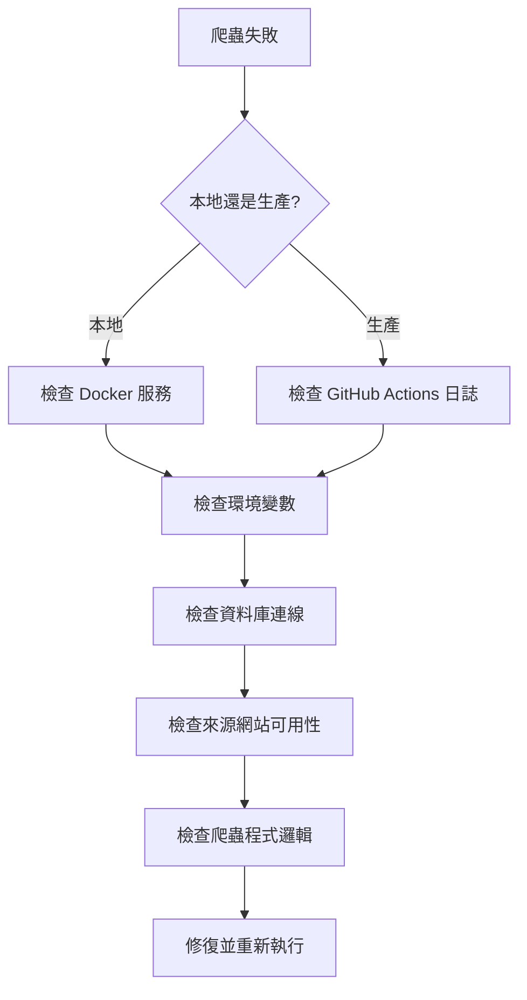

# 爬蟲失敗快速修復指南

## 診斷流程

當爬蟲執行失敗時，按以下順序診斷：



## 快速檢查清單

### 1. 基礎環境檢查（2 分鐘）

```bash
# ✅ Docker 服務運行中?
docker ps | grep postgres

# ✅ 資料庫可連線?
psql $DATABASE_URL -c "SELECT 1;"

# ✅ 環境變數正確?
echo $DATABASE_URL
echo $OPENAI_API_KEY
echo $CRAWLER_ENABLED

# ✅ Node 套件完整?
pnpm install --frozen-lockfile
```

### 2. 爬蟲執行記錄檢查（1 分鐘）

```bash
# 查看最近爬蟲狀態
tsx .github/skills/hk-legal-case-system/scripts/diagnose.ts

# 或直接查詢資料庫
pnpm --filter=@looper-hq/database prisma studio
# 瀏覽 CrawlerJobRun 表，查看 errorLog 欄位
```

### 3. 來源網站可用性測試（3 分鐘）

```bash
# 測試 RSS 來源
curl -I https://www.scmp.com/rss/2/feed

# 測試 HKLII
curl -I https://www.hklii.hk/

# 測試香港司法機構
curl -I https://e-services.judiciary.hk/dcl/
```

## 常見失敗情境與修復

### 情境 1: RSS 爬蟲超時

**症狀**: `CrawlerJobRun.errorLog` 顯示 "RSS timeout"

**診斷**:
```typescript
// 手動測試 RSS 來源
import Parser from 'rss-parser';

const parser = new Parser({ timeout: 30000 });
const feed = await parser.parseURL('https://example.com/rss');
console.log(`Items: ${feed.items.length}`);
```

**修復方法 A**: 增加超時時間
```bash
# .env
RSS_TIMEOUT=60000  # 從 30 秒增加到 60 秒
```

**修復方法 B**: 標記來源為不活躍
```sql
UPDATE "RssSource" 
SET active = false 
WHERE url = 'https://slow-source.com/rss';
```

**修復方法 C**: 添加重試邏輯
```typescript
// scripts/crawlers/rss-news-crawler.ts
async function fetchWithRetry(url: string, maxRetries = 3) {
  for (let i = 0; i < maxRetries; i++) {
    try {
      return await parser.parseURL(url);
    } catch (error) {
      if (i === maxRetries - 1) throw error;
      await delay(5000 * (i + 1)); // 指數退避
    }
  }
}
```

### 情境 2: HKLII 爬蟲反爬機制觸發

**症狀**: 返回 403 Forbidden 或 429 Too Many Requests

**診斷**:
```bash
# 檢查 User-Agent 和請求頻率
curl -A "Mozilla/5.0" https://www.hklii.hk/ -v
```

**修復**:
```typescript
// scripts/crawlers/hklii-crawler.ts
const response = await fetch(url, {
  headers: {
    'User-Agent': 'Mozilla/5.0 (Windows NT 10.0; Win64; x64) AppleWebKit/537.36',
    'Accept': 'text/html,application/xhtml+xml',
    'Accept-Language': 'zh-TW,zh;q=0.9,en;q=0.8',
  },
});

// 添加延遲
await delay(2000); // 每請求間隔 2 秒
```

### 情境 3: 司法機構網站結構變更

**症狀**: 解析到空陣列，或欄位為 null

**診斷**:
```typescript
// 直接訪問並檢查 HTML 結構
import * as cheerio from 'cheerio';

const html = await fetch('https://e-services.judiciary.hk/dcl/').then(r => r.text());
const $ = cheerio.load(html);

// 檢查選擇器是否仍然有效
console.log($('.case-title').length);  // 應 > 0
console.log($('.hearing-date').first().text());
```

**修復**: 更新選擇器
```typescript
// 舊選擇器
const titles = $('.case-title');

// 新選擇器（網站改版後）
const titles = $('div.case-item h3.title');
```

### 情境 4: 資料庫 Unique Constraint 違反

**症狀**: `Unique constraint failed on the fields: (source,externalId)`

**診斷**:
```sql
-- 檢查是否真的重複
SELECT source, "externalId", COUNT(*) as count
FROM "PublicCase"
WHERE source = 'RSS' AND "externalId" = 'xxx'
GROUP BY source, "externalId";
```

**修復**:
```typescript
// 確保使用 upsert 而非 create
await prisma.publicCase.upsert({
  where: {
    source_externalId: { source: 'RSS', externalId: item.guid },
  },
  create: { ...data },
  update: {}, // 已存在則不更新
});
```

### 情境 5: Prisma Client 未生成

**症狀**: `Cannot find module '@looper-hq/database'` 或 `PrismaClient is not a constructor`

**修復**:
```bash
# 重新生成 Prisma Client
pnpm --filter=@looper-hq/database prisma generate

# 如果仍然失敗，清理並重新安裝
rm -rf node_modules packages/database/node_modules
pnpm install --frozen-lockfile
```

### 情境 6: AI 分類失敗（OpenAI API 錯誤）

**症狀**: `Error: OPENAI_API_KEY is required` 或 `Rate limit exceeded`

**診斷**:
```bash
# 測試 API key 是否有效
curl https://api.openai.com/v1/models \
  -H "Authorization: Bearer $OPENAI_API_KEY"

# 或使用 OpenRouter
curl https://openrouter.ai/api/v1/models \
  -H "Authorization: Bearer $OPENAI_API_KEY"
```

**修復方法 A**: Rate Limit - 添加延遲
```typescript
// scripts/batch-classify.ts
for (const caseItem of cases) {
  await classifyCase(caseItem);
  await delay(2000); // 每請求間隔 2 秒
}
```

**修復方法 B**: 更換模型
```bash
# .env
OPENAI_MODEL=anthropic/claude-3.5-sonnet  # 從 gpt-5.1 更換
OPENAI_BASE_URL=https://openrouter.ai/api/v1
```

**修復方法 C**: Token 超限 - 截斷輸入
```typescript
const content = fullContent.substring(0, 1500); // 限制長度
```

## 手動修復腳本範例

### 重新執行單一來源

```bash
# 僅重新執行 RSS 爬蟲
pnpm crawler:rss

# 僅重新執行 HKLII
pnpm crawler:hklii

# 檢查結果
tsx .github/skills/hk-legal-case-system/scripts/verify-data-integrity.ts --source RSS --recent 1
```

### 批量重新分類未分類案件

```typescript
// scripts/reclassify-unclassified.ts
import { PrismaClient } from '@looper-hq/database';
import { classifyCase } from '../apps/web/lib/services/ai-classifier';

const prisma = new PrismaClient();

const unclassified = await prisma.publicCase.findMany({
  where: { aiClassified: false },
  take: 50,
});

for (const item of unclassified) {
  try {
    const result = await classifyCase(
      item.title_zh || item.title_en || '',
      item.summary_zh || item.summary_en || ''
    );
    
    await prisma.publicCase.update({
      where: { id: item.id },
      data: {
        category: result.category,
        court: result.court,
        judge: result.judge,
        aiClassified: true,
        aiConfidence: result.confidence,
      },
    });
    
    console.log(`✅ ${item.id}`);
    await delay(1000);
  } catch (error) {
    console.error(`❌ ${item.id}:`, error.message);
  }
}
```

### 清理錯誤資料

```typescript
// scripts/cleanup-invalid-data.ts
// 刪除缺少必要欄位的記錄

const invalidCases = await prisma.publicCase.findMany({
  where: {
    title_zh: null,
    title_en: null,
    summary_zh: null,
    summary_en: null,
  },
});

console.log(`發現 ${invalidCases.length} 筆無效資料`);

// 需要確認後再刪除
const readline = require('readline');
const rl = readline.createInterface({
  input: process.stdin,
  output: process.stdout,
});

rl.question('確定要刪除? (yes/no): ', async (answer: string) => {
  if (answer === 'yes') {
    await prisma.publicCase.deleteMany({
      where: { id: { in: invalidCases.map(c => c.id) } },
    });
    console.log('✅ 已刪除');
  }
  rl.close();
});
```

## 生產環境故障排除

### GitHub Actions 執行失敗

```bash
# 1. 查看執行日誌
gh run list --workflow=crawler.yml --limit 5
gh run view <run_id> --log-failed

# 2. 手動觸發重新執行
gh workflow run crawler.yml

# 3. 或 SSH 到 Droplet 手動執行
ssh user@droplet-ip
cd /var/www/looper-hq
NODE_ENV=production pnpm crawler:all
```

### 資料庫連線問題（生產）

```bash
# 檢查資料庫服務狀態
sudo systemctl status postgresql

# 檢查連線數
psql $DATABASE_URL -c "SELECT count(*) FROM pg_stat_activity;"

# 檢查慢查詢
psql $DATABASE_URL -c "SELECT query, state, query_start FROM pg_stat_activity WHERE state != 'idle' ORDER BY query_start;"
```

### 磁碟空間不足

```bash
# 檢查磁碟使用
df -h

# 清理舊 log
find /var/log -name "*.log" -mtime +30 -delete

# 清理舊備份
find ~/backups -name "*.sql" -mtime +60 -delete

# PostgreSQL vacuum
psql $DATABASE_URL -c "VACUUM FULL ANALYZE;"
```

## 預防措施

### 1. 監控與告警

```yaml
# .github/workflows/crawler.yml
# 添加失敗通知
- name: Notify on failure
  if: failure()
  run: |
    curl -X POST ${{ secrets.WEBHOOK_URL }} \
      -H 'Content-Type: application/json' \
      -d '{"text": "爬蟲執行失敗！"}'
```

### 2. 健康檢查自動化

```bash
# crontab (每 6 小時檢查一次)
0 */6 * * * tsx /path/to/scripts/crawlers/health-check.ts || mail -s "Crawler Health Check Failed" admin@looper-hq.dev
```

### 3. 資料品質監控

```typescript
// 爬蟲執行後自動驗證
async function postCrawlerValidation() {
  const stats = await prisma.publicCase.groupBy({
    by: ['source'],
    where: { 
      createdAt: { gte: new Date(Date.now() - 24 * 60 * 60 * 1000) } 
    },
    _count: true,
  });

  // 預期每日至少有資料
  const expectedSources = ['RSS', 'HKLII'];
  expectedSources.forEach(source => {
    const count = stats.find(s => s.source === source)?._count || 0;
    if (count === 0) {
      sendAlert(`來源 ${source} 今日無新資料`);
    }
  });
}
```

### 4. 備份策略

```bash
# 每日備份腳本
#!/bin/bash
# scripts/daily-backup.sh

DATE=$(date +%Y%m%d)
pg_dump $DATABASE_URL | gzip > ~/backups/looper_hq_$DATE.sql.gz

# 上傳到 S3 或 DO Spaces
s3cmd put ~/backups/looper_hq_$DATE.sql.gz s3://looper-backups/

# 保留本地 7 天
find ~/backups -name "*.sql.gz" -mtime +7 -delete
```

## 緊急聯絡清單

| 服務 | 問題類型 | 聯絡方式 |
|------|----------|----------|
| DigitalOcean | Droplet/資料庫問題 | support.digitalocean.com |
| HKLII | 網站封鎖 | hklii@hklii.hk |
| OpenAI/OpenRouter | API 問題 | 官方 Discord |
| GitHub | Actions 故障 | github.com/support |

## 除錯檢查清單

當所有方法都失敗時：

- [ ] 重啟 Docker 服務 (`pnpm docker:down && pnpm docker:up`)
- [ ] 清空 node_modules 重新安裝
- [ ] 檢查 `.env` 檔案是否存在且正確
- [ ] 嘗試在另一台機器上執行
- [ ] 查看 GitHub Issues 是否有類似問題
- [ ] 建立最小可複現範例（MRE）
- [ ] 尋求團隊協助

---

**更新日期**: 2026-03-26  
**適用範圍**: Looper HQ 爬蟲系統 v1.0+
